<!DOCTYPE html>
<html>
<head>
	<meta http-equiv="content-type" content="text/html; charset=utf-8"/>
	<title></title>
	<meta name="generator" content="MtscOffice 7.4.2.3 (Windows)"/>
	<meta name="created" content="00:00:00"/>
	<meta name="changed" content="2026-01-11T17:11:05.726000000"/>
</head>
<body lang="en-IN" dir="ltr">

# Healthcare Data Analysis &amp; Reporting ## 📚 Table of Contents
1. [Project Overview](#1-project-overview) 2. [Project
Description](#2-project-description) 3. [Key
Features](#3-key-features) 4. [Tools &amp;
Technologies](#4-tools--technologies) 5. [Project Folder
Structure](#5-project-folder-structure) 6. [Installation &amp; Setup
(One Block for Python + Power BI)](#6-installation--setup) 7. [How to
Run (For both Python EDA + Power BI)](#7-how-to-run) 8. [Detailed
Overview of Health_Care_EDA in
Python](#8-detailed-overview-of-health_care_eda-in-python) &nbsp;&nbsp;&nbsp;&nbsp;
8.1 [Description of the Dataset](#81-description-of-the-dataset) &nbsp;&nbsp;&nbsp;&nbsp;
8.2 [Data Cleaning &amp; Preparation](#82-data-cleaning--preparation)
&nbsp;&nbsp;&nbsp;&nbsp;&nbsp;&nbsp;&nbsp;&nbsp; 8.2.1 [Merging All
Datasets](#821-merging-all-datasets) &nbsp;&nbsp;&nbsp;&nbsp;&nbsp;&nbsp;&nbsp;&nbsp;
8.2.2 [Standardizing Data](#822-standardizing-data) &nbsp;&nbsp;&nbsp;&nbsp;&nbsp;&nbsp;&nbsp;&nbsp;
8.2.3 [Data Integrity Validation](#823-data-integrity-validation)
&nbsp;&nbsp;&nbsp;&nbsp;&nbsp;&nbsp;&nbsp;&nbsp; 8.2.4 [Handling
Missing Values](#824-handling-missing-values) &nbsp;&nbsp;&nbsp;&nbsp;&nbsp;&nbsp;&nbsp;&nbsp;
8.2.5 [Handling Duplicates Records](#825-handling-duplicates)
&nbsp;&nbsp;&nbsp;&nbsp;&nbsp;&nbsp;&nbsp;&nbsp; 8.2.6 [Converting
Datatypes](#826-converting-datatypes) &nbsp;&nbsp;&nbsp;&nbsp;&nbsp;&nbsp;&nbsp;&nbsp;
8.2.7 [Creating Derived Columns](#827-creating-derived-columns)
&nbsp;&nbsp;&nbsp;&nbsp;&nbsp;&nbsp;&nbsp;&nbsp; 8.2.8 [Mapping
Categorical Values](#828-mapping-categorical-values) 9. [Exploratory
Data Analysis (EDA)](#9-exploratory-data-analysis-eda) &nbsp;&nbsp;&nbsp;&nbsp;
9.1 [Univariate Analysis](#91-univariate-analysis) &nbsp;&nbsp;&nbsp;&nbsp;
9.2 [Bivariate Analysis](#92-bivariate-analysis) &nbsp;&nbsp;&nbsp;&nbsp;
9.3 [Multivariate Analysis](#93-multivariate-analysis) &nbsp;&nbsp;&nbsp;&nbsp;
9.4 [Distribution Analysis](#94-distribution-analysis) &nbsp;&nbsp;&nbsp;&nbsp;
9.5 [Correlation Analysis](#95-correlation-analysis) 10. [Detailed
Overview of HealthCare Power BI
Dashboard](#10-detailed-overview-of-power-bi-dashboard) &nbsp;&nbsp;&nbsp;&nbsp;
10.1 [Overview Dashboard](#101-overview-dashboard) &nbsp;&nbsp;&nbsp;&nbsp;
10.2 [Medical Condition &amp; Outcome
Analysis](#102-medical-condition--outcome-analysis) &nbsp;&nbsp;&nbsp;&nbsp;
10.3 [Billing &amp; Insurance
Analysis](#103-billing--insurance-analysis) &nbsp;&nbsp;&nbsp;&nbsp;
10.4 [Doctor &amp; Hospital
Performance](#104-doctor--hospital-performance) &nbsp;&nbsp;&nbsp;&nbsp;
10.5 [Time-Based Analysis](#105-time-based-analysis) 11.
[Author](#11-author) 12. [License](#12-license) ## 📌 1. Project
Overview &nbsp;&nbsp;&nbsp;&nbsp;This project focuses on analyzing
healthcare data to uncover key insights into patient admissions,
medical conditions, treatment outcomes, and hospital performance. By
combining Python for data preparation and cleaning with Power BI for
interactive dashboards, the project aims to support healthcare
administrators in making data-driven operational and clinical
decisions. ## 📌 2. Project Description &nbsp;&nbsp;&nbsp;&nbsp;🩺
The Healthcare Data Analysis and Visualization Project involves
working with a multi-sheet Excel dataset containing patient details,
hospital information, doctor records, and patient visit data. The
project workflow starts with merging and cleaning the data using
Python libraries such as Pandas and NumPy in a Jupyter Notebook
environment. Key data cleaning steps included handling missing
values, standardizing text data, mapping admission type codes,
calculating patient length of stay, and identifying high billing
cases. After preparing a clean and integrated dataset, exploratory
data analysis (EDA) was performed in Python to validate data
distributions and detect anomalies. The prepared dataset was then
visualized in Power BI, where a series of interactive dashboards were
built to deliver actionable insights. The dashboards created include:
🔍 **Overview Dashboard** : Patient Admissions Summary: Visualizing
patient admission counts, age distribution, gender splits, and
admission trends. 🏥 **Medical Condition &amp; Outcome Analysis** :
Analyzing the frequency of medical conditions, treatment outcomes,
and recovery rates. 💵 **Billing &amp; Insurance Analysis** :
Tracking billing amounts, insurance coverage patterns, and flagging
high-cost cases. 🧑‍⚕️ **Doctor &amp; Hospital Performance**
: Evaluating doctor-wise and hospital-wise patient outcomes,
admissions, and billing performance. 📅 **Time-Based Analysis** :
Examining trends over time including admissions, discharges, and
length of stay patterns. This project demonstrates how Python-based
data engineering can seamlessly integrate with BI tools like Power BI
to deliver healthcare insights that improve operational efficiency
and patient care decisions. ## 📌 3. Key Features - 📑 Merges
multiple Excel sheets into a single clean dataset. - 🧹 Cleans and
standardizes patient, doctor, and hospital details. - ⚙️ Handles
missing values (numeric → median, categorical → mode). - 📏
Calculates Length of Stay for each patient. - 💸 Flags patients
with High Billing Amounts. - 🔢 Maps Admission Types to numeric
codes for analysis. - 📊 Performs EDA using Python (Pandas,
Matplotlib, Seaborn). - 📈 Builds Power BI dashboards for dynamic
visual insights. ## 📌4. Tools &amp; Technologies - Python - Pandas
- NumPy - Matplotlib - Seaborn - 📊 Power BI - 📑 Microsoft Excel
- 📓 Jupyter Notebook - 📂 CSV &amp; Excel Files (for data
storage) ## 📌 5. Project Folder Structure ├── 📁 Data/ #
Healthcare Excel dataset files │ └── healthcare_dataset.xlsx
│ ├── 📁 Images/ # Project images for README or dashboards
│ ├── 📁 Python/ # Python notebook, requirements, and
scripts │ ├── HealthCare_EDA.ipynb │ └──
requirements.txt │ ├── 📁 PowerBI/ # Power BI dashboard
files │ └── HealthCare_Dashboard.pbix │ ├── 📄
.gitignore # Git ignore rules ├── 📄 LICENSE # Project open
source license ├── 📄 README.md # Project overview and
documentation ## 📌 6. Installation &amp; Setup (One Block for
Python + Power BI) #### 1️⃣ Clone the repository git clone
[https://github.com/ChandrashekarDevarasetti/Visual-Healthcare-Insights-Python-EDA-Power-BI-Dashboards.git](https://github.com/ChandrashekarDevarasetti/Visual-Healthcare-Insights-Python-EDA-Power-BI-Dashboards)
cd Visual-Healthcare-Insights-Python-EDA-Power-BI-Dashboards #### 2️⃣
Install required Python packages pip install -r
Python/requirements.txt #### 3️⃣ Launch the Jupyter Notebook
jupyter notebook Python/HealthCare_EDA.ipynb #### 4️⃣ Open the
Power BI Dashboard manually: #### Navigate to the 'PowerBI' folder
and open 'HealthCare_Dashboard.pbix' in Power BI Desktop ## 📌 7.
How to Run (For both Python EDA + Power BI) ### Run Python EDA
Notebook #### 1️⃣ Install dependencies &nbsp;&nbsp;&nbsp;&nbsp;
Make sure you have all the necessary dependencies by running the
following command: &nbsp;&nbsp;&nbsp;&nbsp; pip install -r
Python/requirements.txt #### 2️⃣ Launch the Jupyter Notebook &nbsp;&nbsp;&nbsp;&nbsp;
After installing the dependencies, open the Jupyter notebook with the
following command: &nbsp;&nbsp;&nbsp;&nbsp; jupyter notebook
Python/HEALTHCARE_EDA.ipynb #### 3️⃣ In your browser, open the
notebook and run all cells sequentially &nbsp;&nbsp;&nbsp;&nbsp; Once
the notebook is open in your browser, execute all the cells to run
the EDA analysis. ### 📊 Open Power BI Dashboard #### 1️⃣
Install Power BI Desktop &nbsp;&nbsp;&nbsp;&nbsp; If you haven't
already, install Power BI Desktop. You can download it from here.
#### 2️⃣ Open the Power BI file &nbsp;&nbsp;&nbsp;&nbsp; To view
the dashboards, open the Power BI file located in the PowerBI
directory: &nbsp;&nbsp;&nbsp;&nbsp; PowerBI/HealthCare_Dashboard.pbix
#### 3️⃣ Explore all the interactive dashboards &nbsp;&nbsp;&nbsp;&nbsp;
Once the Power BI file is open, you can explore the following
interactive dashboards: - 📊 Overview Dashboard - 🩺 Medical
Condition &amp; Outcome Analysis - 💸 Billing &amp; Insurance
Analysis - 🧑‍⚕️ Doctor &amp; Hospital Performance #### 4️⃣
Refresh the dataset if needed &nbsp;&nbsp;&nbsp;&nbsp; If you need to
refresh the data, connect to the Excel file located under the /data/
directory. ## 📌 8. Detailed Overview of HealthCare_EDA in Python
&nbsp;&nbsp;&nbsp;&nbsp; This notebook begins with a descriptive
exploration of the patient and hospital datasets using summary
statistics and visual analysis. It then examines patterns in patient
demographics, admission types, and medical conditions to understand
what factors may influence hospital stay duration. Finally,
relationships between variables such as department, billing, and
severity of illness are analyzed further. ### 8.1 Description of the
Dataset &nbsp;&nbsp;&nbsp;&nbsp; The data in the healthcare dataset
includes information about patients admitted to hospitals across
different medical conditions. It contains 55500 rows and 17 columns,
with data spanning several years, starting from 2019. The dataset
includes details such as patient ID (P_ID), doctor ID (D_ID),
hospital ID (H_ID), medical condition, date of admission, insurance
provider, billing amount, room number, admission type, discharge
date, medication prescribed, test results, patient name, age, gender,
blood type, doctor name, and hospital name. Key variables in the
dataset include medical condition (Cancer, Diabetes, Asthma,
Hypertension), billing amount (non-negative real numbers), room
number (integer), admission type (Elective, Emergency, Urgent), and
medication (Lipitor, Aspirin, Paracetamol). The age and blood type
variables are numerical, while gender and insurance provider are
categorical variables. The test results vary, with categories like
Inconclusive, Abnormal, Normal and NaN values.
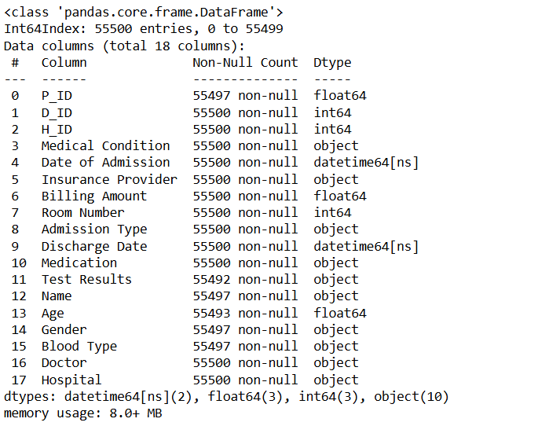 ### 8.2 Data Cleaning &amp;
Preparation &nbsp;&nbsp;&nbsp;&nbsp; Data Cleaning &amp; Preparation
is the process of identifying and fixing errors, inconsistencies, and
missing values in raw data, transforming it into a structured,
reliable, and analysis-ready format for further processing. ####
8.2.1 Merging All Datasets &nbsp;&nbsp;&nbsp;&nbsp; To perform a
complete analysis, we merge all four datasets using their respective
key columns (**P_ID, D_ID, H_ID**). This helps consolidate **patient
details, doctor information, hospital data, and medical history**
into a single unified DataFrame for further exploration and
visualization. 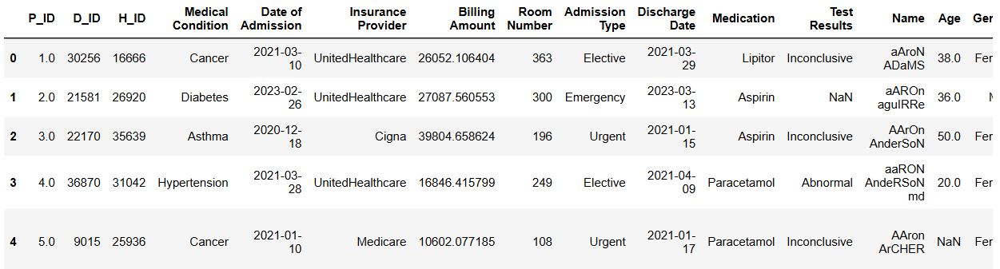 #### 8.2.2
Standardizing Name Fields &amp; Removing Duplicates in merged data
&nbsp;&nbsp;&nbsp;&nbsp; After merging all datasets, we ensure the
`Name`, `Doctor`, and `Hospital` columns are clean and consistently
formatted. This helps eliminate redundancy, avoids mismatched values,
and improves overall data quality for analysis and visualization.
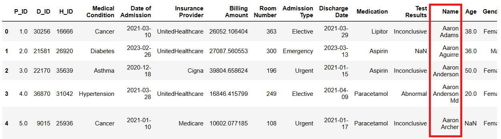 #### 8.2.3 Data
Integrity Validation for Foreign Keys (P_ID, D_ID, H_ID) Identifying
Mismatches and Foreign Key Issues Between P_ID, D_ID, and H_ID in
Merged Data and Master Tables
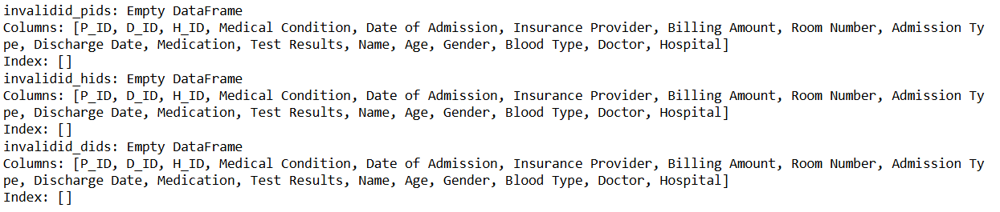 #### 8.2.4 Handling
Missing Values Identifing and appropriately handling missing values
in the dataset to prevent incomplete analysis or errors during
visualization. 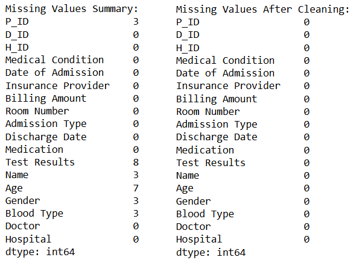 ####
8.2.5 Handling Duplicate Records Identifing and appropriately
handling missing values in the dataset to prevent incomplete analysis
or errors during visualization.
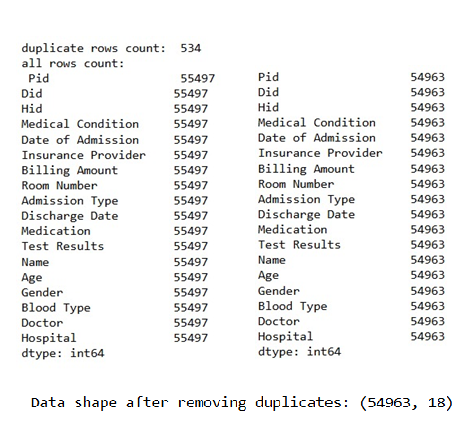 #### 8.2.6
Converting Data Types Ensure all columns have correct data types for
analysis. 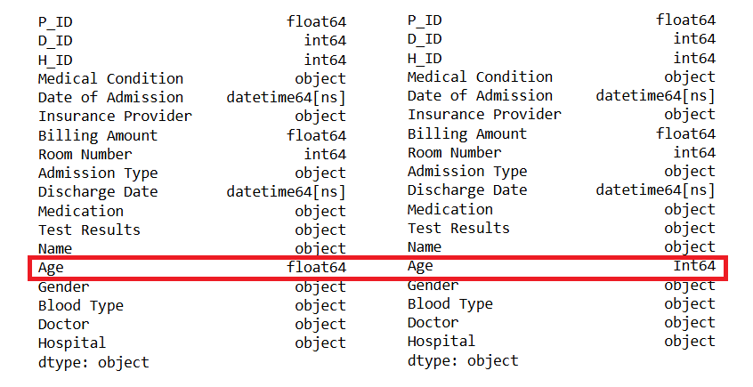
#### 8.2.7 Creating New Derived Columns Creating useful new columns
like Length of Stay or Billing Category.
 #### 8.2.8 Mapping
Categorical Values Mapping or encode categorical values for better
readability or later modeling.
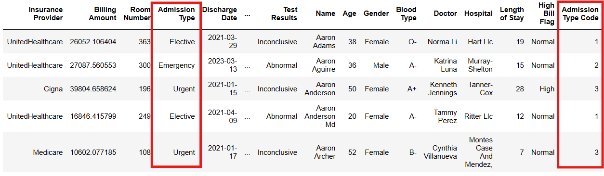
### 📌 9. Exploratory Data Analysis (EDA) Creating charts and
graphs to make sense of data patterns, trends, relationships, and
anomalies visually. 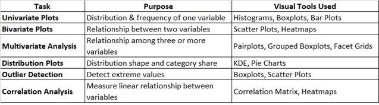 #### 9.1 Univariate
Analysis &nbsp;&nbsp;&nbsp;&nbsp; Univariate Analysis is the simplest
form of data analysis where only one variable is analyzed at a time
to understand its distribution, central tendency, spread, and
underlying patterns. 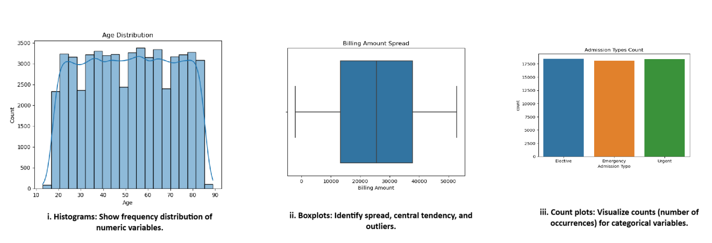 #### 9.2
Bivariate Analysis &nbsp;&nbsp;&nbsp;&nbsp; Bivariate Analysis is the
**analysis of two variables simultaneously** to explore the
**relationship, association, or correlation** between them and
understand how one variable affects or relates to the other.
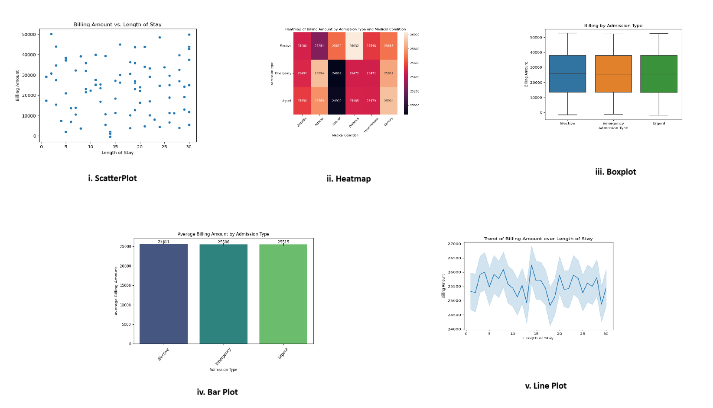 #### 9.3 Multivariate Analysis
Multivariate Analysis is the *analysis of more than two variables
simultaneously* to understand complex relationships, interactions,
and combined effects among multiple variables within a dataset.
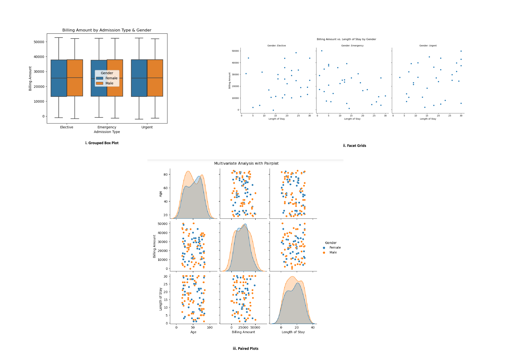 #### 9.4 Distribution
Analysis Understand data distribution patterns and proportions.
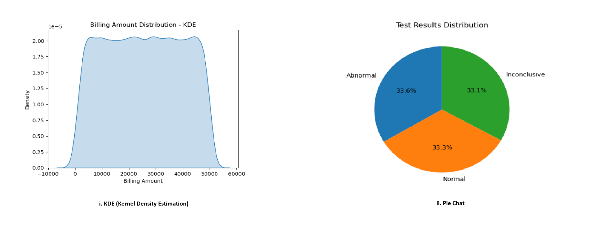 #### 9.5 Correlation
Analysis *Correlation Heatmap:* Show correlation strength between
multiple numeric&nbsp;variables
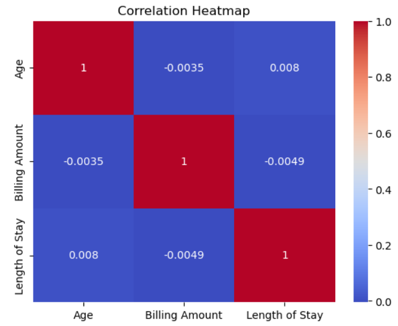 ### 📌 10.
Detailed Overview of HealthCare Power BI Dashboard &nbsp;&nbsp;&nbsp;&nbsp;
This comprehensive Power BI Healthcare Admissions &amp; Billing
Dashboard offers end-to-end insights into patient admissions, medical
conditions, doctor performance, billing trends, and time-based
activity. It includes interactive KPI cards, dynamic charts, matrix
visuals, and drill-through pages for detailed patient-level analysis.
The dashboard empowers stakeholders to monitor hospital operations,
financial performance, and clinical outcomes effectively with
slicers, bookmarks, and customized timelines for rich, interactive
exploration. #### 🔍 10.1 Overview Dashboard **What it does:** This
dashboard provides a quick summary of hospital admissions, patient
volumes, and financial performance. **📊 Visual Insights:** - KPI
cards display total admissions, average stay, total billing, and avg.
billing per patient. - Bar chart shows admissions trend by
year/month. - Donut chart compares Elective vs Emergency admissions.
- Slicers allow filtering by Year, Gender, and Insurance Provider.
**🎯 Result:** Quickly monitor hospital activity, identify
admission trends, and understand patient distribution by type and
demographics at a glance.
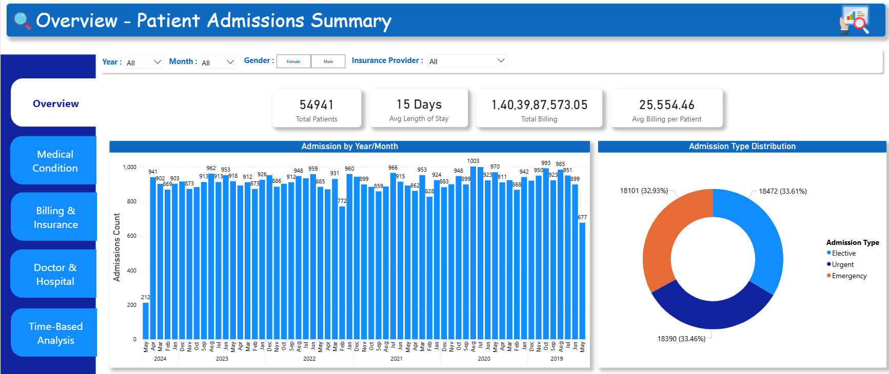 #### 🏥 10.2
Medical Condition &amp; Outcome Analysis **What it does:** This
dashboard highlights patient counts by medical condition and their
corresponding test outcomes. **📊 Visual Insights:** - Stacked bar
chart shows the Top 10 medical conditions by number of patients. -
Matrix displays the outcome distribution (Normal, Abnormal,
Inconclusive) for each condition. - Table lists patient details,
filterable by condition and doctor using slicers. **🎯 Result:**
Quickly identify which conditions are most common, how patients are
performing in tests, and filter detailed patient lists for deeper
analysis.
 #### 💵
10.3 Billing &amp; Insurance Analysis **What it does:** This
dashboard tracks hospital billing patterns, insurance provider
contributions, and cost relationships. **📊 Visual Insights:** -
Bar chart compares total billing amounts by insurance provider. -
Line chart shows billing trends over time. - Scatter chart visualizes
how billing amounts relate to patient length of stay, color-coded by
medical condition. **🎯 Result:** Easily monitor financial
performance, identify top-paying insurers, and spot patterns between
costs, patient stays, and conditions.
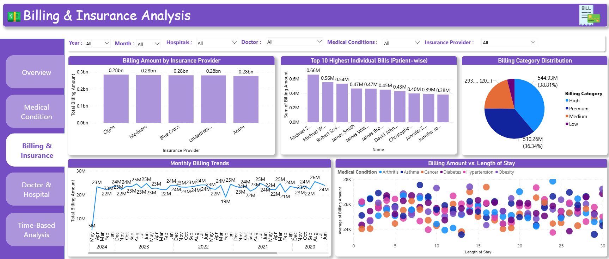 ####
🧑‍⚕️ 10.4 Doctor &amp; Hospital Performance **What it
does:** This dashboard evaluates doctor workload, patient outcomes,
and hospital-wise admissions. **📊 Visual Insights:** -
Table/Matrix shows each doctor’s patient count, average billing,
and average length of stay. - Bar chart displays number of admissions
per hospital. - Heat map cross-tabulates doctors with admission types
and test results. **🎯 Result:** Identify high-performing doctors,
hospital patient loads, and how test results vary by doctor and
admission type.
 #### 📅
10.5 Time-Based Analysis **What it does:** This dashboard tracks
patient admissions over time, helping spot trends and seasonal
patterns. **📊 Visual Insights:** - Line chart shows admission
trends over time. - Calendar heatmap highlights daily admissions
activity. - Custom timeline (via bookmarks) lets users switch views
by Year → Quarter → Month → Date. - Drill-through pages provide
patient-level details from any time point. **🎯 Result:**
Understand how admissions fluctuate over time, identify peak periods,
and drill down to patient records on specific dates for deeper
analysis.
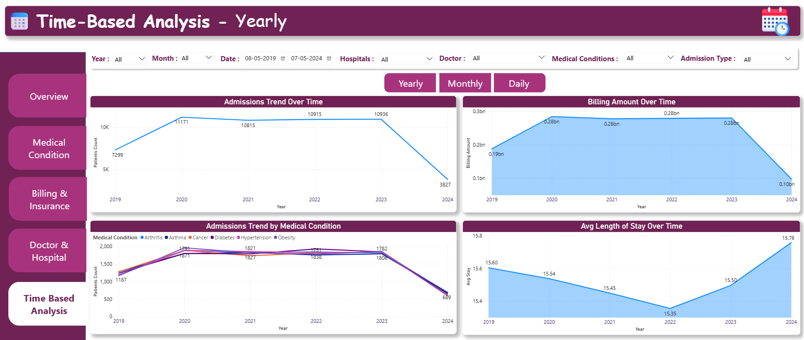
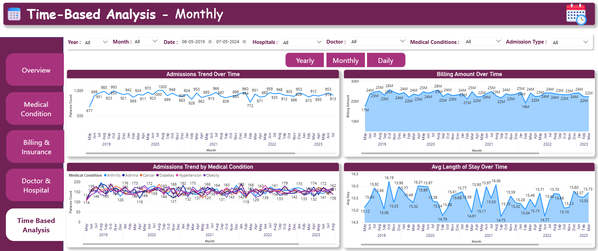
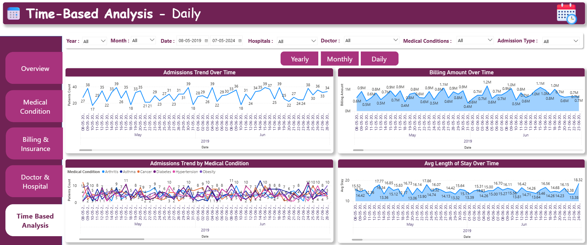
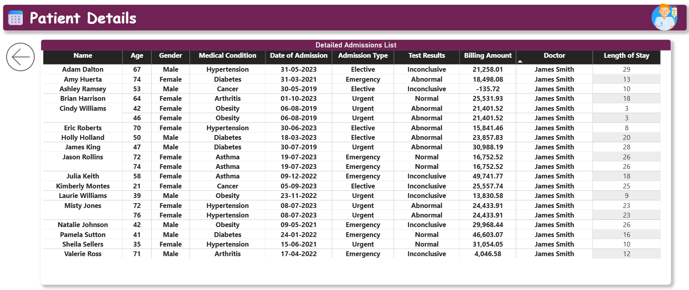
## 👨‍💻 11. License This project is licensed under the [MIT
License](LICENSE). 

</body>
</html>